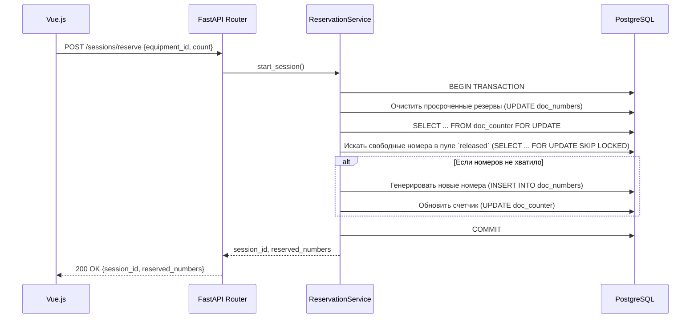

# Архитектура проекта "Журнал регистрации УТЗ"

## Обзор

Проект представляет собой клиент-серверное приложение для регистрации документов по оборудованию. Бэкенд предоставляет
REST API, а фронтенд — это современное одностраничное приложение (SPA).

### Технологический стек

- **Бэкенд:** Python 3.11+, FastAPI (async), SQLAlchemy 2.0 (async), PostgreSQL 15+, Alembic, Pydantic v2.
- **Фронтенд:** Vue.js 3, TypeScript, Vite, Pinia, Vue Router, Vuetify, TanStack Query.
- **Инфраструктура:** Docker, Docker Compose, Nginx (в качестве реверс-прокси для API и хостинга фронтенда).
- **Инструменты:** Poetry (управление зависимостями), Ruff/Black (качество кода), Pytest (тестирование).

### Ключевые принципы

- **Архитектура бэкенда:** Многоуровневая (Роутеры → Сервисы → Репозитории).
- **Валидация:** Pydantic-схемы на стороне API и ограничения на уровне БД (`UNIQUE`, `FOREIGN KEY`, `NOT NULL`).
- **Идентификация:** Упрощенная, на основе HTTP-заголовка `X-User`.
- **Конкурентность:** Транзакционная безопасность при резервировании номеров достигается за счет блокировок уровня БД (
  `SELECT FOR UPDATE`, `SKIP LOCKED`).
- **Фоновые задачи:** Просроченные резервы номеров (TTL) очищаются с помощью APScheduler.

## Структура проекта

```text
.
├── app/                  # Исходный код бэкенда (FastAPI)
│   ├── core/             # Конфигурация, БД, аутентификация
│   ├── models/           # Модели SQLAlchemy (ORM)
│   ├── repositories/     # Слой доступа к данным (Data Access Layer)
│   ├── schemas/          # Схемы Pydantic (валидация API)
│   ├── services/         # Слой бизнес-логики
│   ├── routers/          # Роутеры FastAPI (API endpoints)
│   ├── tasks/            # Фоновые задачи (APScheduler)
│   └── utils/            # Вспомогательные утилиты
├── frontend/             # Исходный код фронтенда (Vue.js)
│   ├── src/
│   │   ├── api/          # Клиент Axios для взаимодействия с бэкендом
│   │   ├── components/   # Переиспользуемые Vue-компоненты
│   │   ├── composables/  # Composition API функции (логика UI)
│   │   ├── layouts/      # Компоненты-макеты страниц
│   │   ├── router/       # Конфигурация Vue Router
│   │   ├── stores/       # Хранилища Pinia (управление состоянием)
│   │   ├── types/        # TypeScript-типы для API
│   │   └── views/        # Компоненты-страницы
├── alembic/              # Миграции базы данных
└── tests/                # Тесты Pytest для бэкенда
```

## Роли и взаимодействие слоев (Бэкенд)

- **`routers`:** Определяют HTTP-эндпоинты, принимают запросы, валидируют входные данные с помощью Pydantic и вызывают
  сервисы. Формируют HTTP-ответы.
- **`services`:** Инкапсулируют бизнес-логику. Оркестрируют вызовы репозиториев, управляют транзакциями и обрабатывают
  доменные ошибки.
- **`repositories`:** Выполняют конкретные запросы к базе данных через SQLAlchemy. Отвечают за CRUD-операции и
  применение блокировок.
- **`models`:** ORM-сущности, определяющие структуру таблиц и ограничения в базе данных.
- **`schemas`:** Pydantic-модели, описывающие "контракт" API для запросов и ответов.

## Ключевые сущности БД

- **`equipment`:** Оборудование, к которому привязываются документы.
- **`documents`:** Основная таблица журнала. Каждая запись имеет уникальный номер (`numeric`) и привязана к
  оборудованию.
- **`doc_numbers`:** Статусная модель для управления жизненным циклом номеров (`reserved`, `assigned`, `released`).
- **`sessions`:** Сессии резервирования, хранящие информацию о пользователе, TTL и статусе пула номеров.
- **`doc_counter`:** Служебная таблица (одна строка) для хранения глобального счетчика номеров.
- **`audit_logs`:** Журнал изменений документов, который ведут администраторы.

## Сценарий резервирования номеров (Happy Path)

Сценарий инициируется фронтендом, который отправляет POST-запрос на `/api/v1/sessions/reserve`.



## Идентификация и права доступа (RBAC)

- **Идентификация:** Осуществляется через HTTP-заголовок `X-User`. При первом запросе для пользователя создается запись
  в таблице `users`.
- **Роли:** Роль "Администратор" присваивается пользователям, чьи логины перечислены в переменной окружения
  `ADMIN_USERS`.
- **Ограничения:**
    - Обычные пользователи не могут резервировать "золотые" номера (оканчивающиеся на `00`).
    - Только администраторы имеют доступ к админ-панели и могут редактировать любые документы.

## Добавление нового функционала (Чек-лист)

1. **Бэкенд:**
    - При необходимости, изменить модель в `app/models` и создать миграцию Alembic.
    - Определить схемы запроса/ответа в `app/schemas`.
    - Добавить методы в репозиторий (`app/repositories`).
    - Реализовать бизнес-логику в сервисе (`app/services`).
    - Создать эндпоинт в роутере (`app/routers`).
    - Написать тесты в `tests/`.
2. **Фронтенд:**
    - Обновить типы в `frontend/src/types/api.ts`.
    - Создать `composable`-функцию в `frontend/src/composables` с использованием `useQuery`/`useMutation` для
      взаимодействия с новым API.
    - Создать или обновить Vue-компоненты/страницы для отображения данных и взаимодействия с пользователем.
    - При необходимости, добавить новый маршрут в `frontend/src/router`.
